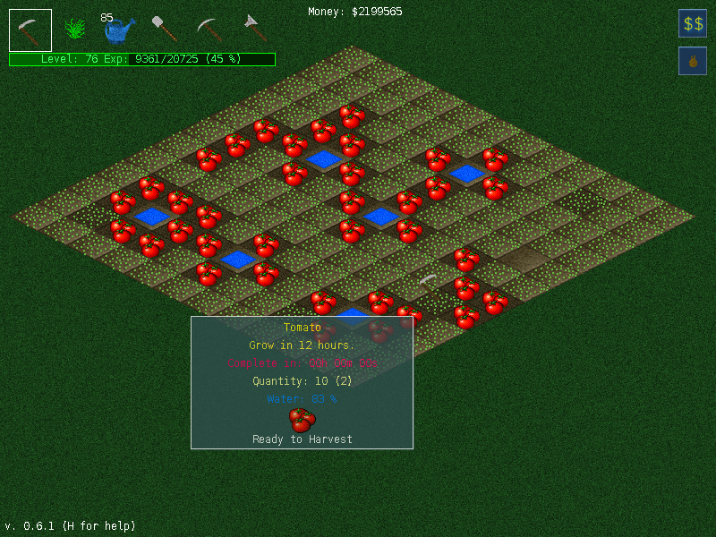

Python farm game
================

Farming game where you can plant strawberries, onions, beans, carrots, potatos, tomatos and radishes.
Use axe and pickaxe to remove plank and stone and shovel to remove anthill.

Writen in python using pygame game library and supports Python 2.7 and 3.x.

Creator: orneo1212 <orneo1212@gmail.com>
GitHub (source): https://github.com/orneo1212/PythonFarmGame

recent development:
GitHub (source): https://github.com/MarkusHackspacher/PythonFarmGame

Keys
----

- S - Show/hide Market
- I - Show/hide inventory
- M - Mute/Unmute sound
- H - Help window
- A - Screenshot

Tools
-----

- Sickle - Use it to harvest seeds.
- Plant - Plant new seed selected in inventory
- Watercan - Use it to water a seed. (grow time decrease)
- Shovel - Use it to remove planted seeds.
- Pickaxe - Use it to remove stones.
- Axe - Use it to cut off the planks.

Licence
-------

GPL v3 ( http://gplv3.fsf.org or LICENSE included with game)
